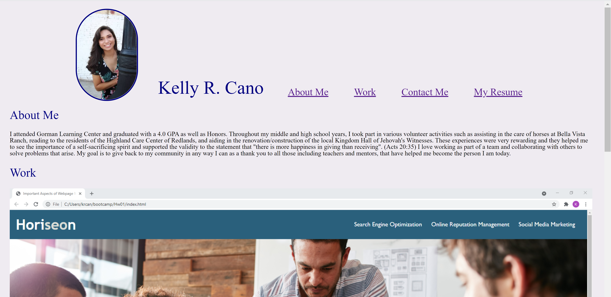

# Hw02
# Advanced CSS: Portfolio

## Description

This project is my personal portfolio. Currently  I am a student and I'm still in the learning process so I have only one link to my work so far however, I have a few features on my portfolio I'd like to highlight. The page has a the ability to scroll to the corresponding spot on the page according to which naviagation link you press. The images under the work subheading will take you to the site where my project is located. Under 'Contact me' the phone number, email and github link should take you directly to how you can contact me. Truth be told, I have put a lot of blood, sweat, and tears in this portfolio page and personally there are some things I would like to change/ fix but really resumes and portfolios will continually be a work in progress throughout my career and will never just be finished because I will always have more to add. I learned a lot from this project, it taught me how to input images into the css file rather than just in the html file and it has helped me become a little more comfortable wiht the display flex properties, but of course there will always be more to learn. In the future I would like to add some more design aspects to my portfolio to make it stand out wiht color and maybe change up the layout a little.

[live site](https://krcano.github.io/Hw02/)
## MIT License

Copyright (c) [2021] [Kelly R. Cano]

Permission is hereby granted, free of charge, to any person obtaining a copy
of this software and associated documentation files (the "Software"), to deal
in the Software without restriction, including without limitation the rights
to use, copy, modify, merge, publish, distribute, sublicense, and/or sell
copies of the Software, and to permit persons to whom the Software is
furnished to do so, subject to the following conditions:

The above copyright notice and this permission notice shall be included in all
copies or substantial portions of the Software.

THE SOFTWARE IS PROVIDED "AS IS", WITHOUT WARRANTY OF ANY KIND, EXPRESS OR
IMPLIED, INCLUDING BUT NOT LIMITED TO THE WARRANTIES OF MERCHANTABILITY,
FITNESS FOR A PARTICULAR PURPOSE AND NONINFRINGEMENT. IN NO EVENT SHALL THE
AUTHORS OR COPYRIGHT HOLDERS BE LIABLE FOR ANY CLAIM, DAMAGES OR OTHER
LIABILITY, WHETHER IN AN ACTION OF CONTRACT, TORT OR OTHERWISE, ARISING FROM,
OUT OF OR IN CONNECTION WITH THE SOFTWARE OR THE USE OR OTHER DEALINGS IN THE
SOFTWARE.
